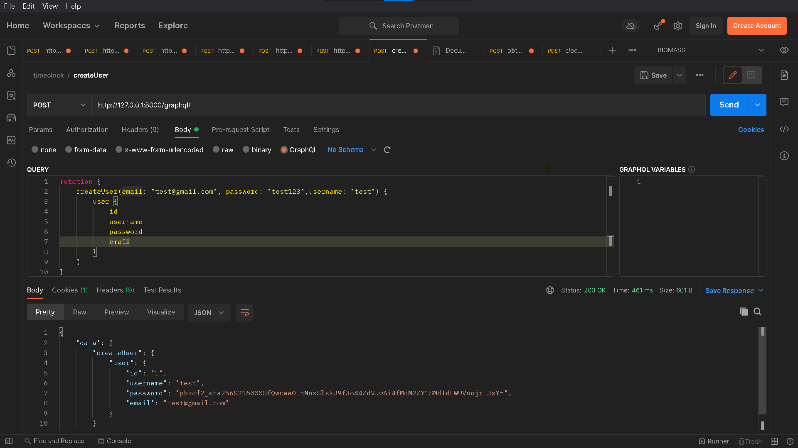
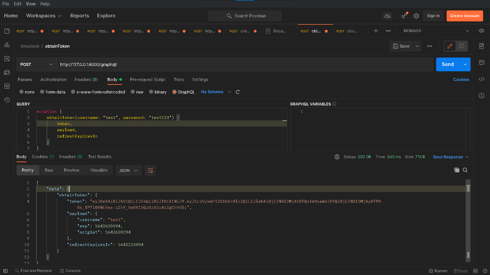
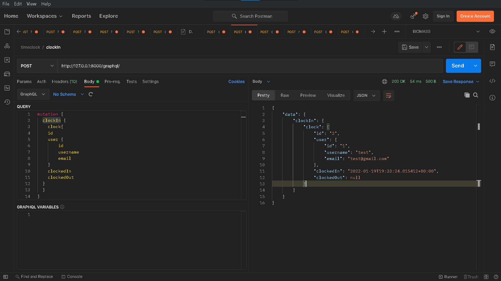
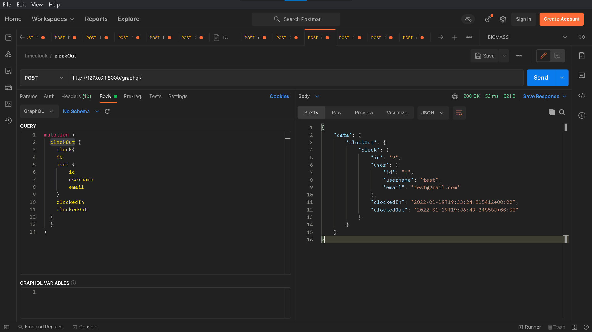
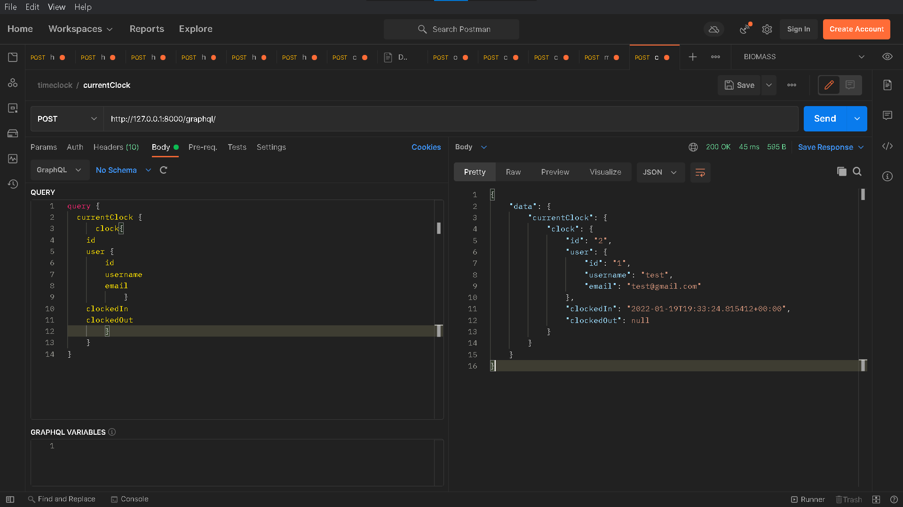
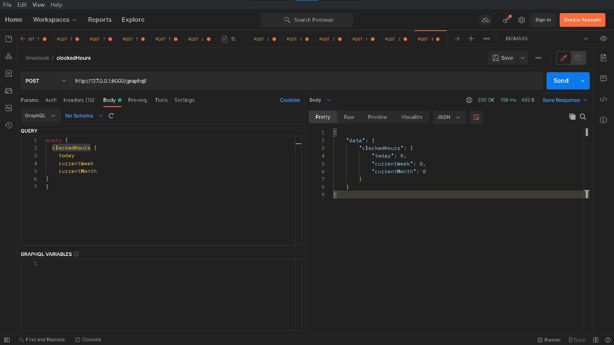

# TimeClock 

## Prerequsite
- Python 3.10.0
- sqlite
- Postman

```code
    pip install -r requirements.txt
```
### Deploy
- setup database and deploy to server

```code
    cd app
    python manage.py makemigrations  
    python manage.py migrate
    python manage.py runserver 
```
#### Api endpoints
  - Query
    - me
    - currentClock
    - clockedHours
  - Mutations
    - createUser(email, password, username)
    - obtainToken(username, password)
    - clockIn
    - clockOut

##### Test
- POST http://127.0.0.1:8000/graphql/
- open postman app and import timeclock.postman_collection.json file to Postman app
- Steps 
  - createUser 
  - obtainToken #(copy token and placed at header as Authorization=JWT XXXXXXXXXX , for next steps)
  - clockIn
  - clockOut
  - currentClock
  - clockedHours

###### Sample Output
- createUser
  
- obtainToken
  
- clockIn
  
- clockOut
  
- currentClock
  
- clockedHours
  


